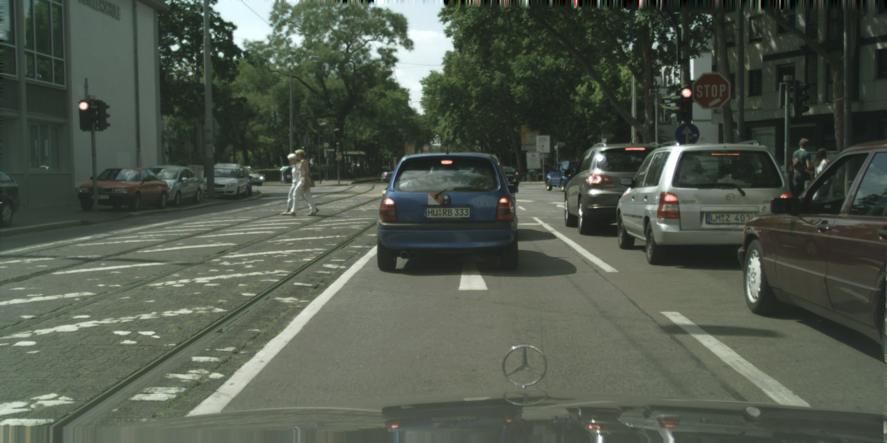
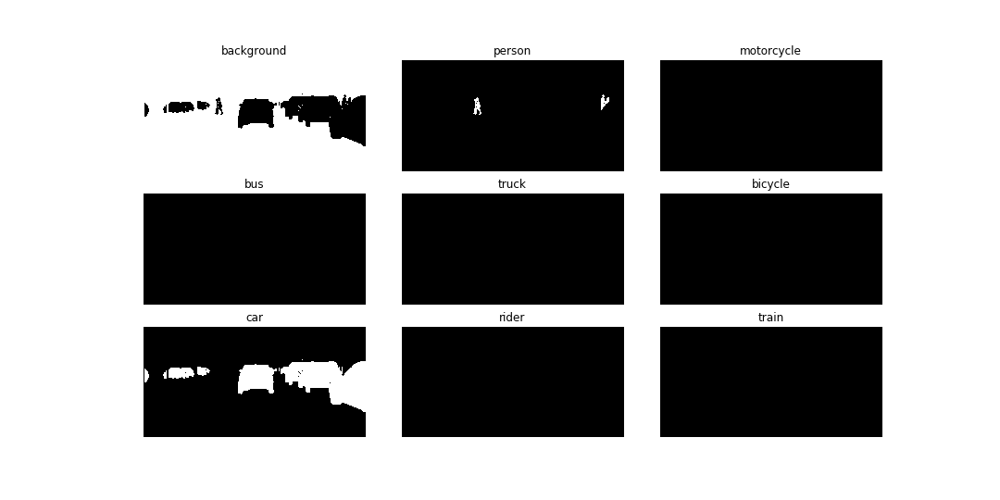
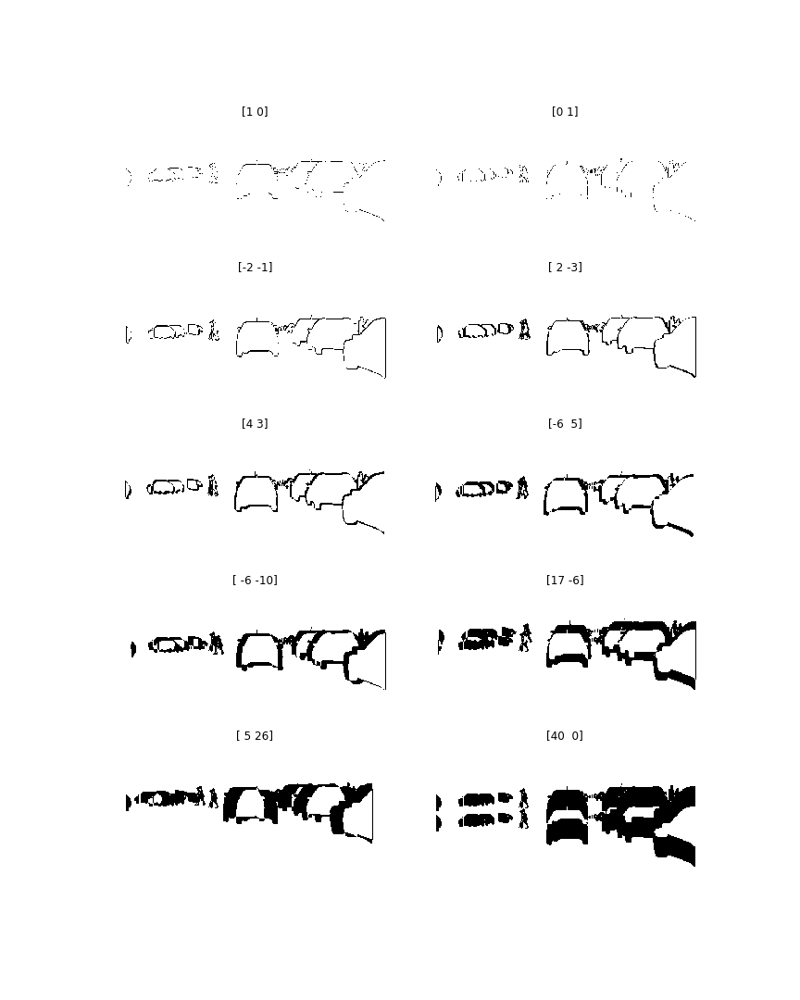
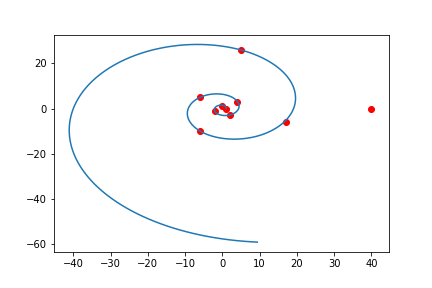

# MergeNet
A novel method to do instance segmentation in a semantic segmentation and speech decoding fashion. It doesn't need any bounding boxes or regions of interest to detect objects. Instead, it uses the pixel-wise "class" and "offset" output to dynamically merge pixels into instances. 

## Oracle Example
### Original Image
This is a sample image from [Cityscapes](https://www.cityscapes-dataset.com) dataset.


### Classes output
The probability of one pixel belongs to each classes as in semantic segmentation.


### Offsets output
The probability of one pixel (x, y) is of the same instance with its offset pixel (x+i, y+j). 

#### Offset values
We choose offset values (i, j) from a [Logarithmic spiral](https://en.wikipedia.org/wiki/Logarithmic_spiral) to approximately get the relationship between one pixel to its neighborhood and in turn the shape of each instance. Note that a large offset (e.g. ```[-40, 0]```) is especially necessary and helpful when there is occlusion. 



### Merging Process
We use a priority queue to greedly merge instances when it can improve the total log-likihood of the image. We initialize the merging state by assigning each pixel with a distinct instance ID and we stop merging when the queue is empty (i.e. a ```merging``` operation can no longer improve the log-likihood).
 
